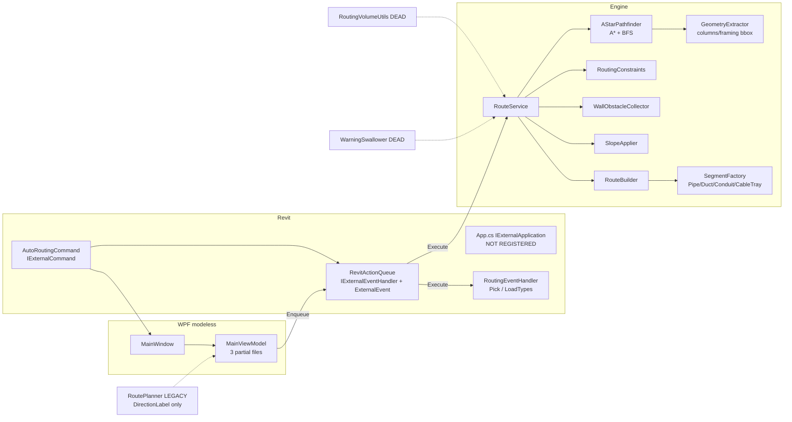
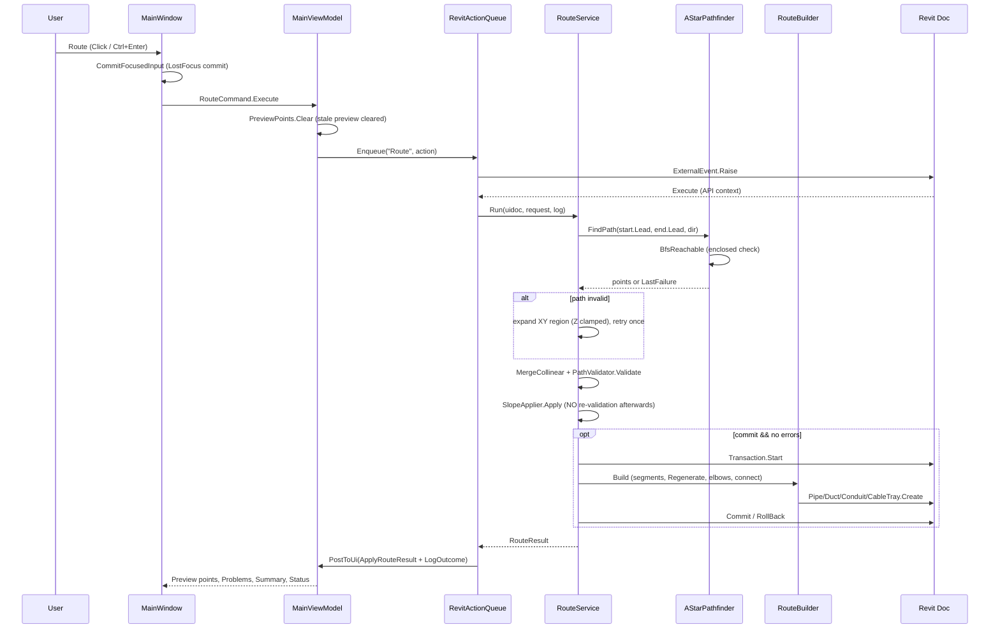
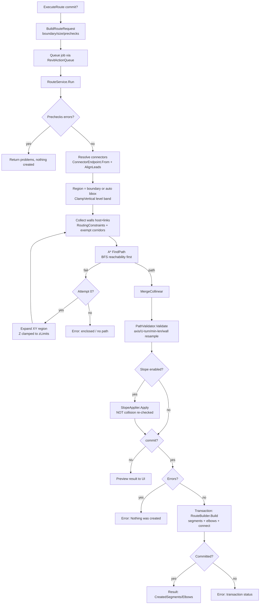

# MEPAutoRouting – Actual Architecture

> Every component below was confirmed by reading the current source. Components marked
> **[DEAD]** exist but are never called. Components marked **[UI-ONLY]** render in the window
> but have no effect on routing.

## 1. Project Structure

| Layer | Files | Responsibility |
|---|---|---|
| Core | App.cs **[NOT REGISTERED]**, AutoRoutingCommand.cs, AStarPathfinder.cs, GeometryExtractor.cs, RoutingVolumeUtils.cs **[DEAD]** | Entry points, pathfinding, obstacle boxes |
| Routing | RouteService.cs, RouteBuilder.cs, RoutingEventHandler.cs, RouteModels.cs, ISegmentFactory.cs, RoutePlanner.cs **[LEGACY – only `DirectionLabel` used]** | Orchestration + model creation |
| Shared | Geometry, constraints, boundaries, slope, connector helpers, queue | Pure logic + Revit helpers |
| Shared\Revit | RevitActionQueue.cs, RouteFailureCollector.cs | Modeless→Revit bridge, failure preprocessing |
| Plumbing / Mechanical / Electrical | PipeSegmentFactory, DuctSegmentFactory, ConduitSegmentFactory (+CableTraySegmentFactory) | `Pipe.Create` / `Duct.Create` / `Conduit.Create` / `CableTray.Create` |
| UI | MainWindow.xaml(.cs), Themes, ViewModels (3 partial files + UserSettings + LogEntry) | Modeless WPF window, MVVM |

## 2. Active Entry Point

- Manifest: [MEPAutoRouting.addin](../MEPAutoRouting.addin) → `FullClassName = MEPAutoRouting.Core.AutoRoutingCommand`, AddInId `8D83C886-…-3F85F2D1A111`, VendorId `CUNDALL.HK`.
- **Exactly one active route workflow**: `AutoRoutingCommand.Execute` → `MainWindow` → `MainViewModel.ExecuteRoute` → `RevitActionQueue` → `RouteService.Run`.
- [Core/App.cs](../Core/App.cs) (`IExternalApplication`, ribbon tab "MEP Tools") **is not registered in any .addin** → the ribbon button is never created; the command has no UI entry point inside Revit.
- Legacy `UnifiedRoutingCommand` exists only in `UI/*.snippet` (not compiled) and in the stale Revit 2024 manifest.

## 3. Component Responsibilities (confirmed)

| Component | File | Responsibility |
|---|---|---|
| `AutoRoutingCommand` | Core/AutoRoutingCommand.cs:18 | Single-instance window owner; creates handler + queue + VM |
| `RevitActionQueue` | Shared/Revit/RevitActionQueue.cs:13 | `IExternalEventHandler`; `ConcurrentQueue` drained inside `ExternalEvent`; file+UI logging |
| `RoutingEventHandler` | Routing/RoutingEventHandler.cs:21 | Pick source/target (`PickObject`) and LoadTypes; invoked **through the queue**, never gets its own `ExternalEvent` |
| `MainViewModel` | UI/ViewModels/*.cs | All UI state; `ExecuteRoute` posts work to the queue |
| `RouteService` | Routing/RouteService.cs:32 | Validation → leads → region → `ClampVertical` → walls → constraints → A* (+1 retry) → validate → slope → transaction |
| `AStarPathfinder` | Core/AStarPathfinder.cs:84 | Aligned 6-dir A*, BFS pre-check, obstacle filtering, `LastFailure` |
| `RoutingConstraints` | Shared/RoutingConstraints.cs:8 | Wall clearance + boundary contains + exempt corridors |
| `WallObstacleCollector` | Shared/WallObstacle.cs:37 | Host + linked walls as centre-line obstacles |
| `GeometryExtractor` | Core/GeometryExtractor.cs:20 | Bounding boxes: columns / structural columns / framing (walls explicitly skipped) |
| `RouteBuilder` | Routing/RouteBuilder.cs:15 | Segments, elbows, end connections; caller owns transaction |
| `RouteFailureCollector` | Shared/Revit/RouteFailureCollector.cs:9 | Warnings→PROBLEMS; errors→`ProceedWithRollBack` |
| `SlopeApplier` | Shared/SlopeApplier.cs:18 | Applies gradient run-by-run after path validation |
| `PathValidator` | Shared/RouteProblem.cs:23 | Axis-alignment, zero-length, U-turn, min-length, wall re-check |

## 4. Execution Sequence

```
Revit ribbon (intended) / AddInManager
  → AutoRoutingCommand.Execute                 [Revit API context]
      → new RoutingEventHandler + RevitActionQueue.Create (ExternalEvent.Create)
      → new MainViewModel → new MainWindow (modeless, owner = Revit main window)
      → vm.RequestLoadTypes()  ──queued──▶ RoutingEventHandler.LoadTypes
User clicks Route / Preview / F5 / Ctrl+Enter
  → MainWindow.RunCommand → CommitFocusedInput → RouteCommand/PreviewCommand
  → MainViewModel.ExecuteRoute(commit)         [UI thread]
      → GetConstraintInputs (boundary, size, pre-checks)
      → RevitActionQueue.Enqueue("Route", action)
  → ExternalEvent raises → RevitActionQueue.Execute  [Revit API context]
      → RouteService.Run(uidoc, request, log)
          → ConnectorEndpoint.From ×2, AlignLeads
          → region (boundary | auto) + ClampVertical (level band)
          → WallObstacleCollector.Collect (host + links)
          → RoutingConstraints (+2 exempt corridors)
          → AStarPathfinder.FindPath (BFS pre-check, 6-dir A*)
          → retry once with expanded XY region (Z clamped to zLimits)
          → PathUtils.MergeCollinear → PathValidator.Validate
          → SlopeApplier.Apply (if enabled)
          → if commit && no errors: Transaction "MEP Auto Route"
                → RouteBuilder.Build (segments → Regenerate → elbows → connect ends)
                → RouteFailureCollector warnings/errors
                → Commit or RollBack
      → PostToUi: ApplyRouteResult + LogOutcome   [UI thread]
```

## 5. Revit API Boundary

- **All** Revit API calls from the modeless window go through `RevitActionQueue.Enqueue` (route, preview, picks, boundary picks, size loading, type loading).
- `RevitActionQueue.Execute` catches `OperationCanceledException` and `Exception` per action; failures go to `%AppData%\MEPAutoRouting\error.log` + OUTPUT.
- Exceptions: `vm.IsBusy`, `vm.Status`, `vm.DocumentTitle` are set **on the Revit thread** inside `RoutingEventHandler.Execute` (Routing/RoutingEventHandler.cs:40-58) — WPF auto-marshals scalar INPC, so this works but is fragile.
- No `Task.Run`, no `async void`, no timers, no background threads anywhere.

## 6. Transaction Boundary

- Exactly **one** transaction: `new Transaction(doc, "MEP Auto Route")` in RouteService.cs:186.
- No TransactionGroup / SubTransaction. One undo step.
- Rollback paths: pre-commit errors (return before `Start`), exception (`catch` → `RollBack`), Revit errors (`RouteFailureCollector` → `ProceedWithRollBack`), non-committed status.
- Elbow failures are **per-elbow caught** and do NOT roll back segments (by design, warning issued).

## 7. Error Propagation

- Route failures → `RouteProblem` list → PROBLEMS tab + status bar + OUTPUT. No `TaskDialog` anywhere in the solution.
- A* failures → `AStarPathfinder.LastFailure` (reason + diagnostics) → mapped to `RouteProblem.Error`.
- Unexpected exceptions → `RevitActionQueue.SafeLog` → error.log + OUTPUT; never escape `ExternalEvent.Execute`.

## 8. Component Diagram



## 9. Routing Sequence Diagram



## 10. Route Pipeline Flowchart


